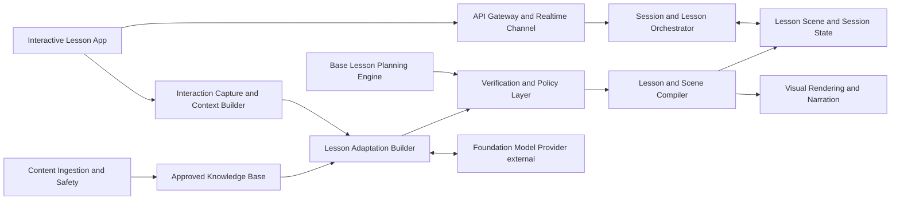

# Proposed architecture

The lesson is a graph of nodes with narration, semantic scene objects, transitions, explanation branches, and a saved return anchor—not an MP4. Pointer selection is a deterministic hit-test against controlled object IDs, so it does not require a vision model. An accepted branch is compiled into declarative scene instructions; no renderer is included.

This is proposed. The two planning nodes are the learned boundary; verification, state, rendering, cache/asset delivery, retrieval/mathematical tools, and monitoring infrastructure are outside it.

| Crossing | Direction | Representation | Controller |
|---|---|---|---|
| Structured lesson request | into planning | versioned request | Orchestrator |
| Interruption context | into planning | bounded packet | Context Builder |
| Retrieved evidence | into planning | approved references | Knowledge Base |
| Provider request / response | out of / into planning | constrained payload | Planning service |
| Tool request / result | out of / into planning | allowlisted call/result | Tools |
| Base proposal | out | declarative plan | Base Engine |
| Adaptation/clarification | out | typed response | Adaptation Builder |
| Bounded revision | in | one checked instruction | Verification |

The stub implements only an adaptation proposal and return anchor.
